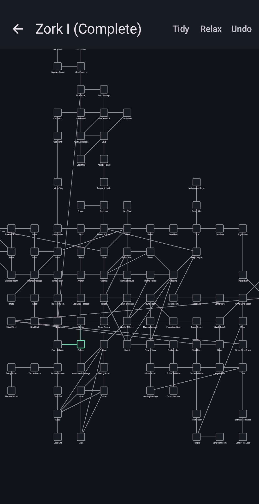
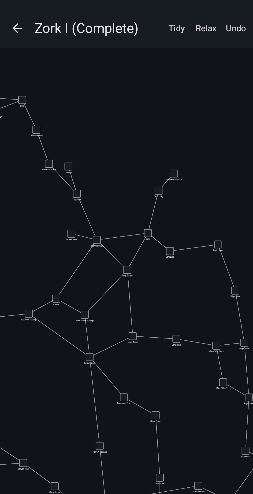

# Droid Mapper

A manual map tool for Infocom-style text adventures. Draw your game world as
rooms and passages in 12 directions — the 8 compass points, UP/DOWN for
vertical movement, and IN/OUT for contained spaces ("enter the shack").
Then let it lay the map out so you can actually see it.

Built for the classic problem: you're deep in a maze with twisty little
passages and you have no idea where you are. Droid Mapper is the map you draw
by hand while you play.

## Controls

| Gesture | Action |
|---|---|
| Drag | Pan |
| Pinch | Zoom |
| Tap a room | Read-only detail window (tap anywhere to dismiss) |
| Double-tap a room | Edit sheet (name, description, notes; Manage exits → direction wheel; delete room) |
| Long-press a passage line | Passage dialog: mark it one-way or delete the passage |
| Direction wheel | Attach a passage to an adjacent room in one of 12 directions |

A direction with no exit is *blocked* by design (same as the game): the wheel
shows it greyed and tapping it does nothing. IN/OUT rooms are *contained*
spaces: they hug the room they belong to instead of sitting on a compass
bearing — Tidy parks them in the nearest free neighbor slot, and Relax pulls
them into contact with their parent.

**One-way passages** — long-press a line to open the passage dialog and flip
the switch (or delete the passage entirely; re-create it from a room's
wheel). On the map a one-way passage draws an arrowhead at the destination
box edge, and the reverse direction is blocked: tapping it in the wheel does
nothing instead of creating a phantom room. A passage that merely *lacks*
a reverse record (not explored yet) stays a plain line — only a deliberate
mark gets the arrow.

## Layouts

Two layouts, one tap each, fully deterministic:

- **Tidy** — deterministic grid: BFS from the current room, compass-true
  (north is always up), label-aware spacing so long names don't collide.
- **Relax** — force-directed spring relaxation seeded from Tidy. Passages
  pull rooms toward their declared direction; repulsion + centering gravity
  keep regions apart. Result on the Zork I reference: total passage length
  −18%, edge crossings −49% vs Tidy.

Both are non-destructive (undo stack) and idempotent (a second tap does
nothing). Same map, same data — only the layout differs (the green highlight
is a selected room):

| Tidy (grid, compass-true) | Relax (spring relaxation) |
|---|---|
|  |  |

## The Zork I reference map

`samples/zork1.json` is the complete Zork I world — 110 rooms, 351 exits —
extracted from the [Inform source](https://github.com/allengarvin/inform-zork1)
with the game's actual exit semantics:

- a room's own declaration wins over reverse records
- exits gated by messages/switches (`OneWay`, lamp checks, etc.) and the
  authentic maze self-loops are dropped (the app has no loop concept)
- the four genuine one-way maze tunnels ("you won't be able to get back
  up") are forward-only `oneWay` records with arrowheads on the map
- the three door objects (trap door, kitchen window, grating) resolve to the
  opposite room
- `IN`/`OUT` declarations that merely repeat a compass exit to the same room
  stay as compass exits (a note records the game's IN/OUT wording)

It's not bundled into the APK — it's a reference layout to study what a
complete adventure map looks like. The five genuine IN/OUT passages in Zork
(cook, cyclops, Hades gate, mine entrance, timber/drafty) run *parallel* to a
compass exit to the same room in the game ("west" and "in"), so the sample
keeps them as compass edges with a note on each room.

## Building

Android project: Kotlin + Jetpack Compose, minSdk 24, no runtime
dependencies beyond the standard Compose/BOM set.

```bash
./gradlew assembleDebug          # app/build/outputs/apk/debug/app-debug.apk
./gradlew testDebugUnitTest      # 79 unit tests
```

### Updating without losing maps

Maps live in the app's private storage (`files/maps/`) and survive an in-place
APK update — but **never uninstall to update**: Android wipes that storage on
uninstall. In-place updates only work when the APKs are signed with the same
key, so this repo pins `app/droidmapper.keystore` (committed on purpose — a
personal sideloaded app; the keystore's job is to outlive machines) and signs
both debug and release builds with it. If a build from another machine's
key is already installed, the one-time migration is: `adb shell run-as
com.jrod.droidgridder tar c -C files maps > maps-backup.tar` (before
uninstalling), then after installing the new APK, `adb push maps-backup.tar
/data/local/tmp/ && adb shell run-as com.jrod.droidgridder tar xf
/data/local/tmp/maps-backup.tar -C files`.

### Architecture

```
model/    pure Kotlin, zero Android imports
          MapModel (immutable MapFile), MapGraph (pure mutation fns),
          AutoLayout (Tidy), SpringLayout (Relax)
data/     MapJson (kotlinx-serialization), MapStore (files/maps/<id>.json)
ui/       Compose: map canvas, detail window, edit sheet, direction wheel
```

`MapFile` is immutable; every mutation goes through a pure `MapGraph`
function and a synchronous `store.save`. The model layer is unit-tested on
the bare JVM (no Robolectric).

## Known limits

- Relax minimizes total edge length, not crossings (crossing minimization
  is NP-hard). ~10% of passages may render on the far side of their declared
  compass direction, mostly at high-degree junctions.
- No multi-floor concept: UP/DOWN are directions like the rest.
- Containment is flat, not nested: an IN/OUT room is placed *beside* its
  parent (hugging it), not rendered inside the parent's box. True nested
  interiors (Infocom's 1983 paper-map style) are a future feature.
- There's no export button — maps are plain JSON files in `files/maps/`
  (import *is* supported: paste map JSON from the map list).